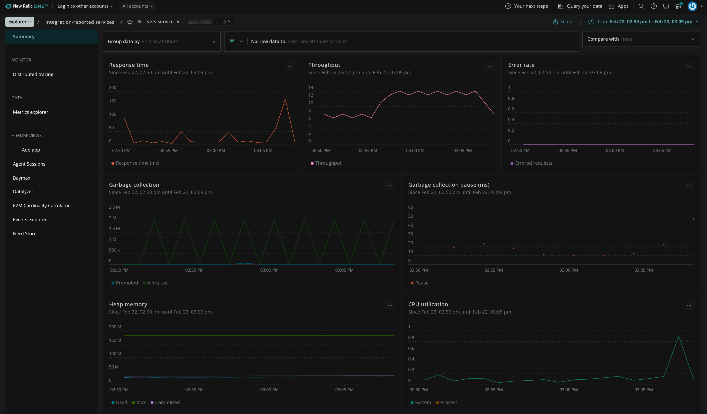
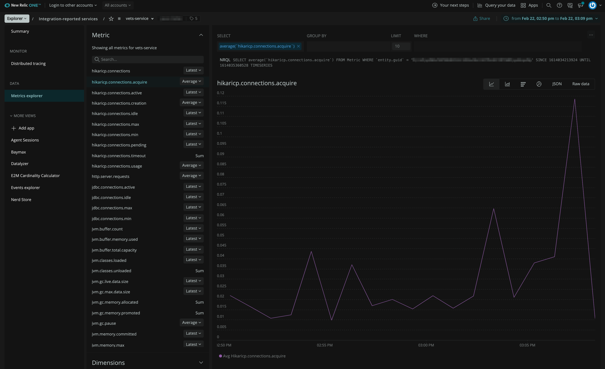
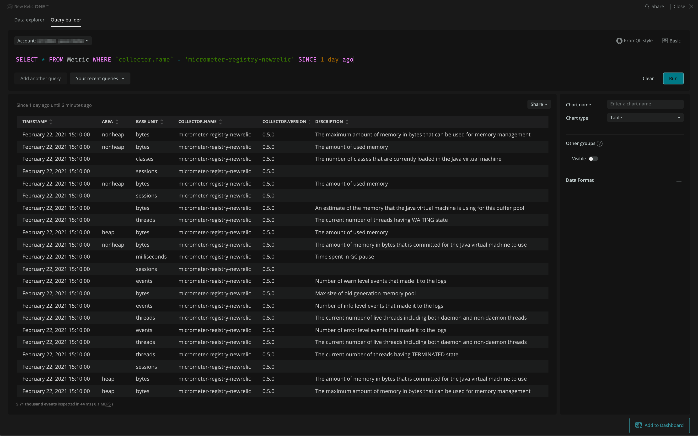

# Archival Notice

❗Notice: This project has been archived _as is_ and is no longer actively maintained.

### OpenTelemetry Micrometer Shim 

To send Micrometer metrics to New Relic, bridge Micrometer to the [OpenTelemetry SDK](https://github.com/open-telemetry/opentelemetry-java) using the [micrometer shim](https://github.com/open-telemetry/opentelemetry-java-instrumentation/tree/main/instrumentation/micrometer/micrometer-1.5/library), and configure the OpenTelemetry SDK to export via OTLP (OpenTelemetry Protocol) to [New Relic's OTLP endpoint](https://docs.newrelic.com/docs/more-integrations/open-source-telemetry-integrations/opentelemetry/get-started/opentelemetry-set-up-your-app/).

See Overview of [OpenTelemetry data in the UI](https://docs.newrelic.com/docs/more-integrations/open-source-telemetry-integrations/opentelemetry/view-your-data/opentelemetry-view-your-data/) for details on how to make use of Micrometer data on the New Relic platform.

The [OpenTelemetry Micrometer Shim example](https://github.com/newrelic/newrelic-opentelemetry-examples/tree/main/java/micrometer-shim) demonstrates how to configure Micrometer to bridge metrics to OpenTelemetry and send it to New Relic via [OTLP](https://developer.newrelic.com/opentelemetry-masterclass/fundamentals/otlp/). The [New Relic OpenTelemetry SDK Config](https://github.com/newrelic/newrelic-opentelemetry-examples/tree/main/java/sdk-nr-config) demonstrates how to configure the OpenTelemetry SDK to export to New Relic via OTLP. Bringing both examples together yields the following configuration:

```java
package io.opentelemetry.example.micrometer;

import io.micrometer.core.aop.TimedAspect;
import io.micrometer.core.instrument.MeterRegistry;
import io.opentelemetry.api.OpenTelemetry;
import io.opentelemetry.exporter.otlp.metrics.OtlpGrpcMetricExporter;
import io.opentelemetry.instrumentation.micrometer.v1_5.OpenTelemetryMeterRegistry;
import io.opentelemetry.sdk.OpenTelemetrySdk;
import io.opentelemetry.sdk.metrics.Aggregation;
import io.opentelemetry.sdk.metrics.InstrumentType;
import io.opentelemetry.sdk.metrics.SdkMeterProvider;
import io.opentelemetry.sdk.metrics.export.AggregationTemporalitySelector;
import io.opentelemetry.sdk.metrics.export.DefaultAggregationSelector;
import io.opentelemetry.sdk.metrics.export.PeriodicMetricReader;
import io.opentelemetry.sdk.resources.Resource;
import java.time.Duration;
import java.util.Optional;
import org.springframework.boot.SpringApplication;
import org.springframework.boot.autoconfigure.SpringBootApplication;
import org.springframework.context.annotation.Bean;

@SpringBootApplication
public class Application {

  public static void main(String[] args) {
    SpringApplication.run(Application.class, args);
  }

  // Enable @Timed annotation
  @Bean
  public TimedAspect timedAspect(MeterRegistry registry) {
    return new TimedAspect(registry);
  }

  @Bean
  public OpenTelemetry openTelemetry() {
    return OpenTelemetrySdk.builder()
        .setMeterProvider(
            SdkMeterProvider.builder()
                .setResource(
                    Resource.getDefault().toBuilder()
                        .put("service.name", "micrometer-shim")
                        // Include instrumentation.provider=micrometer to enable micrometer metrics
                        // experience in New Relic
                        .put("instrumentation.provider", "micrometer")
                        .build())
                .registerMetricReader(
                    PeriodicMetricReader.builder(
                            OtlpGrpcMetricExporter.builder()
                                .setEndpoint("https://otlp.nr-data.net:4317")
                                .addHeader(
                                    "api-key",
                                    Optional.ofNullable(System.getenv("NEW_RELIC_LICENSE_KEY"))
                                        .filter(str -> !str.isEmpty() && !str.isBlank())
                                        .orElseThrow())
                                // IMPORTANT: New Relic requires metrics to be delta temporality
                                .setAggregationTemporalitySelector(
                                    AggregationTemporalitySelector.deltaPreferred())
                                // Use exponential histogram aggregation for histogram instruments
                                // to
                                // produce better data and compression
                                .setDefaultAggregationSelector(
                                    DefaultAggregationSelector.getDefault()
                                        .with(
                                            InstrumentType.HISTOGRAM,
                                            Aggregation.base2ExponentialBucketHistogram()))
                                .build())
                        // Match default micrometer collection interval of 60 seconds
                        .setInterval(Duration.ofSeconds(60))
                        .build())
                .build())
        .build();
  }

  @Bean
  public MeterRegistry meterRegistry(OpenTelemetry openTelemetry) {
    return OpenTelemetryMeterRegistry.builder(openTelemetry).build();
  }
}
```

### New Relic Micrometer registry

❗Notice: Everything below this point details the archived New Relic Micrometer registry and may not apply to the recommended OpenTelemetry Micrometer Shim detailed above.

A [Micrometer metrics](https://micrometer.io/) registry for sending dimensional metrics to New Relic using the [New Relic Java Telemetry SDK](https://github.com/newrelic/newrelic-telemetry-sdk-java).

This registry should be able to be used both within a Spring Boot application, or any application that uses
micrometer for recording metrics.

Note: the micrometer project currently includes a NewRelicMeterRegistry that writes metrics to NewRelic as 
custom events. This implementation is intended to supersede that, as [dimensional metrics](https://docs.newrelic.com/docs/using-new-relic/data/understand-data/new-relic-data-types#dimensional-metrics) are a better fit for micrometer metrics than custom [events](https://docs.newrelic.com/docs/using-new-relic/data/understand-data/new-relic-data-types#events-new-relic). 

### Javadoc for this project can be found here: [![Javadocs][javadoc-image]][javadoc-url]

[javadoc-image]: https://www.javadoc.io/badge/com.newrelic.telemetry/micrometer-registry-new-relic.svg
[javadoc-url]: https://www.javadoc.io/doc/com.newrelic.telemetry/micrometer-registry-new-relic

### Usage

1) via gradle: 
  
    `implementation 'com.newrelic.telemetry:micrometer-registry-new-relic:0.10.0'`

    Note: you might need to also include a dependency on micrometer-core itself, for example:

    `implementation 'io.micrometer:micrometer-core:1.6.4'`
    
2) via maven:

```
    <dependency>
        <groupId>com.newrelic.telemetry</groupId>
        <artifactId>micrometer-registry-new-relic</artifactId>
        <version>0.10.0</version>
    </dependency>
```

3) The registry class is `com.newrelic.telemetry.micrometer.NewRelicRegistry`. 
It will need to be built via a `com.newrelic.telemetry.micrometer.NewRelicRegistryConfig` implementation. An example of how you might do that is in the wiki: [Spring-Config-Example](https://github.com/newrelic/micrometer-registry-newrelic/wiki/Spring-Config-Example)

In order to send metrics to New Relic, you will also need an Insert API Key. Please see [New Relic Api Keys](https://docs.newrelic.com/docs/apis/get-started/intro-apis/types-new-relic-api-keys#) for more information.

And, that's it!

### Find and use your data

For an in-depth breakdown of how Micrometer metrics are converted to New Relic dimensional metrics please read the [Micrometer exporter specification](https://github.com/newrelic/newrelic-exporter-specs/tree/master/micrometer).

Once telemetry data is received from the Micrometer registry, New Relic automatically detects the telemetry data as Micrometer metrics and creates a default summary page using those metrics. The service summary includes charts for response time, throughput, and error rate, as well as charts showing JVM metrics. You can also group and filter the charts by the dimensions available on the metrics.

Micrometer summary page


Additionally, if you wish to create your own charts based on other Micrometer metrics then you can use the [Metrics explorer](https://docs.newrelic.com/docs/insights/use-insights-ui/explore-data/metric-explorer-search-chart-metric-timeslice-data) and [Query builder](https://docs.newrelic.com/docs/query-your-data/explore-query-data/query-builder/introduction-query-builder) to build your own [dashboard](https://docs.newrelic.com/docs/query-your-data/explore-query-data/dashboards/introduction-dashboards).

Metrics explorer


Query builder


### Additional documentation

* [General documentation](https://docs.newrelic.com/docs/integrations/open-source-telemetry-integrations/micrometer/micrometer-metrics-registry)
* [Blog demo](https://blog.newrelic.com/product-news/how-to-monitor-spring-boot-applications-using-micrometer-metrics/)
* For tips on how to find and query your data, see [Find metric data](https://docs.newrelic.com/docs/data-ingest-apis/get-data-new-relic/metric-api/introduction-metric-api#find-data).
* [Query New Relic data](https://docs.newrelic.com/docs/using-new-relic/data/understand-data/query-new-relic-data)
* [Intro to NRQL](https://docs.newrelic.com/docs/query-data/nrql-new-relic-query-language/getting-started/introduction-nrql)

### Building

The project uses gradle 7.5.1 for building, and the gradle wrapper is provided.

To compile, run the tests and build the jar:

`$ ./gradlew build`

## Support

New Relic hosts and moderates an online forum where customers can interact with New Relic employees as well as other customers to get help and share best practices. Like all official New Relic open source projects, there's a related Community topic in the New Relic Explorers Hub. You can find this project's topic/threads here:

https://discuss.newrelic.com/tags/javaagent

### Contributing

We encourage your contributions to improve the New Relic Micrometer registry! Keep in mind that when you submit your pull request, you'll need to sign the CLA via the click-through using CLA-Assistant. You only have to sign the CLA one time per project.

If you have any questions, or to execute our corporate CLA (which is required if your contribution is on behalf of a company), drop us an email at opensource@newrelic.com.

**A note about vulnerabilities**

As noted in our [security policy](../../security/policy), New Relic is committed to the privacy and security of our customers and their data. We believe that providing coordinated disclosure by security researchers and engaging with the security community are important means to achieve our security goals.

If you believe you have found a security vulnerability in this project or any of New Relic's products or websites, we welcome and greatly appreciate you reporting it to New Relic through [HackerOne](https://hackerone.com/newrelic).

If you would like to contribute to this project, review [these guidelines](./CONTRIBUTING.md).

### Licensing

The New Relic Micrometer registry is licensed under the Apache 2.0 License.
